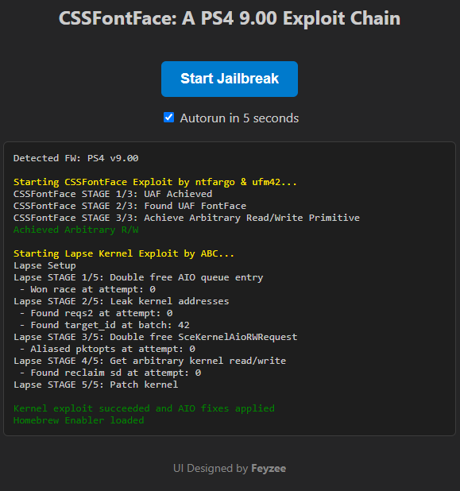

<h1 align="center">CSSFontFace WebKit Exploit & Lapse Kernel Exploit for PS4</h1>
<h3 align="center">Fork of <a href="https://github.com/ufm42/wobkot">wobkot</a> & <a href="https://github.com/ps3120/CSSFontFace-Exploit">CSSFontFace-Exploit</a></h3>
&nbsp;

<h4 align="center">⚠️ This repository is for research and educational purposes only</h4>

🚧 Beta / Work in Progress: Target to achieve a full exploit for 9.00 to 11.02

⚠️ This project is still under active development and beta testing. Firmware-specific issues may occur.

## 📌 Overview
This repository is a research-focused fork of CSSFontFace & Lapse Exploit that aims to improve the reliability and success rate of existing public exploit code.

 

---

## ⚖️ Legal Notice & Disclaimer:

- Jailbreaking, circumventing security, or deploying exploits may be illegal in some jurisdictions.
- It is your responsibility to ensure compliance with local laws.
- The developer assumes **no responsibility** for any potential damage, data loss, or issues that may occur on your PlayStation console as a result of using this repository.
- Use it at your own risk and only on your own devices.

## 🚀 Major Changes

- **Single-File** `.js` **Conversion** — All `.mjs` files have been removed and converted into a single plain `.js` file. This greatly improves cross-platform compatibility and simplifies loading requirements.
- **Log Optimization** — Cleaned up and commented out standard "success path" debugging logs to reduce side effects and improve runtime consistency.
    > ⚠️ **Note:** This optimization only applies to success messages. All warnings, errors, and other critical diagnostic logs remain fully intact and active.
- **Lapse Integration** — Merged with the Lapse core from the [psfree_lapse](https://github.com/Feyzee61/psfree_lapse) repository.
- **Caching Support** — Implemented built-in caching support for ease of use without requiring a PC.

## 📝 ToDo & Status

- [ ] Write ROPs for firmware versions `10.00` to `11.02`
- [x] **Firmware Compatibility:** Only version `9.00` has been fully tested so far.

> 💡 *Note: If you test this on other firmware versions, feel free to open an issue or submit a PR to update the compatibility list!*

## 📝 Notes:

> Firmware 7.00–9.60 includes integrated PSFree kernel patch shellcodes and **AIO patch sets**.

> All payload binaries (`*.bin`, `*.elf`) were intentionally excluded. This repository does not include `payload.bin` file. Place your preferred Homebrew Enabler (HEN) payload in the **public** directory.

> Step-by-step jailbreak instructions were omitted for legal and ethical compliance.

> No modifications that alter the exploit logic in ways affecting device security outside test context.

## 💻 Local Self-Hosting

You can self-host the project using Python's built-in HTTP server.

When in the root directory:

Windows: `py host.py`

Linux/macOS: `python3 host.py`

On your PS4 browser, navigate to: `https://YOUR_PC_IP/public`

## 🤝 Contributing

Contributions are welcome! Feel free to open pull requests for bug fixes, UI improvements or additional features.

## 📄 License

This project is licensed under the **AGPL-3.0 License**.

Please review the [LICENSE](LICENSE) before redistributing or modifying the code.

## 💖 Credits

* **[ntfargo](https://github.com/ntfargo)** - Bug Research, Writeup, Exploit Development [CSSFontFace-Exploit](https://github.com/ntfargo/CSSFontFace-Exploit)
* **[ufm42](https://github.com/ufm42)** - Bug Research, Full Chain Exploit Development [wobkot](https://github.com/ufm42/wobkot)
* **[ps3120](https://github.com/ps3120)** - Lapse implementation to CSSFontFace [CSSFontFace-Exploit](https://github.com/ps3120/CSSFontFace-Exploit)
* **ABC** - Lapse core software
* **Dr.Yenyen** - Testing through all supported firmwares
* **ps4dev team** for their continuous support and invaluable contributions to the PS4 research ecosystem. This project stands on the hard work of all the developers behind it — none of this would be possible without their efforts.
* everyone who tested the updates across various firmware versions and supported the project with their valuable feedback.

## 📬 Contact

For questions or issues, please open a GitHub issue on this repository.
